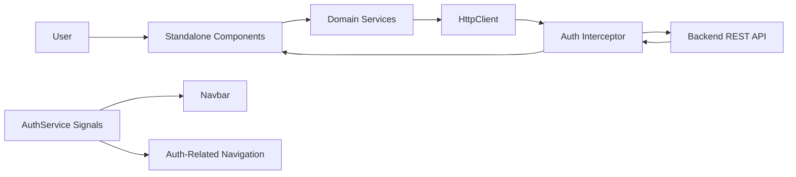

# Meeting Room Booking Frontend

Professional project documentation for the Angular frontend used to manage meeting rooms and bookings.

## 1. Project Overview

This application provides a web interface for:

- User authentication (register, login, logout)
- Viewing available rooms
- Creating, listing, editing, and cancelling bookings
- Filtering bookings by room

The frontend is built with Angular standalone components and communicates with a REST API backend.

## 2. Technology Stack

- Angular 20 (standalone architecture)
- TypeScript
- Angular Router (lazy-loaded standalone routes)
- Angular HttpClient with interceptor-based auth
- Angular Reactive Forms
- RxJS
- Karma + Jasmine (unit test setup)

## 3. Runtime Architecture

### 3.1 High-Level Component/Service Interaction



### 3.2 Layer Responsibilities

- UI Layer: Feature components under `src/app/features` render views, capture user interaction, and call services.
- Domain Service Layer: Services under `src/app/core/services` define all HTTP communication and return typed observables.
- Cross-Cutting Infrastructure: Interceptor and guard under `src/app/core` provide token handling and route-protection capability.
- Shell Layer: App root and shared navbar under `src/app` and `src/app/shared` host navigation and router outlet.

## 4. Module and Folder Structure

```text
src/app
	core/
		guards/          # Route access protection logic
		interceptors/    # HTTP request/response cross-cutting concerns
		models/          # DTOs and response contracts
		services/        # API-facing business/data services
	features/
		auth/            # Login and registration flows
		rooms/           # Room discovery/listing UI
		bookings/        # Booking CRUD and room-filtered listing
	shared/
		components/      # Reusable UI shell components (navbar)
```

## 5. Routing and Navigation Design

The app uses lazy-loaded standalone routes configured in `src/app/app.routes.ts`.

| Route | Purpose |
|---|---|
| `/` | Redirects to `/rooms` |
| `/rooms` | Room list view |
| `/bookings` | All bookings view |
| `/rooms/:id/bookings` | Bookings filtered by room |
| `/bookings/new` | Create booking form |
| `/bookings/:id/edit` | Edit booking form |
| `/login` | Login page |
| `/register` | Registration page |
| `/**` | Fallback redirect to `/rooms` |

Additional note:

- Router is initialized with `withComponentInputBinding()` in `app.config.ts`, enabling route parameters to bind to component inputs when needed.

## 6. Authentication and Authorization Flow

### 6.1 Login/Register

`AuthService` (`src/app/core/services/auth.service.ts`) handles auth operations:

- `POST /auth/login`
- `POST /auth/register`

On success:

- JWT token is stored in local storage (`token`)
- User payload is stored in local storage (`user`)
- Reactive auth signals are updated:
	- `isLoggedIn`
	- `currentUser`

### 6.2 Logout

Logout clears local storage and resets auth signals. The navbar triggers logout and routes the user to `/login`.

### 6.3 Request Authentication

`authInterceptor` (`src/app/core/interceptors/auth.interceptor.ts`) behavior:

- Reads token from `AuthService`
- Adds `Authorization: Bearer <token>` to outgoing requests when token exists
- On HTTP 401:
	- Calls `logout()`
	- Redirects to `/login`

## 7. Room and Booking Domain Flows

### 7.1 Room Listing

`RoomList` component calls `RoomService.getAll()` which maps to:

- `GET /rooms`

From the room list, users can:

- Navigate to room-specific bookings: `/rooms/:id/bookings`
- Start booking creation with preselected room via query string: `/bookings/new?roomId=<id>`

### 7.2 Booking Listing

`BookingList` component resolves route params and chooses endpoint dynamically:

- No room id: `GET /bookings`
- With room id: `GET /bookings/room/:roomId`

Cancellation flow:

- User confirms cancellation in UI
- Component calls `BookingService.cancel(id)`
- Service issues `DELETE /bookings/:id`
- Component refreshes list on success

### 7.3 Booking Create/Edit Form

`BookingForm` component supports both create and edit modes:

- Create mode: route `/bookings/new`
- Edit mode: route `/bookings/:id/edit`

Data loading behavior:

- Loads rooms for dropdown via `GET /rooms`
- In edit mode loads booking via `GET /bookings/:id`
- If query param `roomId` exists, prepopulates `roomId`

Submission behavior:

- Create: `POST /bookings`
- Update: `PUT /bookings/:id`

Validation:

- Required fields and max lengths
- Email format validation
- Cross-field rule: end time must be after start time

## 8. Data Contracts

Models are defined in `src/app/core/models`:

- `auth.model.ts`: `LoginDto`, `RegisterDto`, `AuthResponse`
- `room.model.ts`: `Room`
- `booking.model.ts`: `Booking`, `CreateBookingDto`, `UpdateBookingDto`

These interfaces provide compile-time contract safety between UI and API responses.

## 9. Environment and Configuration

Environment files:

- Development: `src/environments/environment.ts`
- Production: `src/environments/environment.production.ts`

Current API base URLs:

- Development: `https://localhost:7200/api`
- Production placeholder: `https://production-api.com/api`

Before deploying, replace the production placeholder URL with the real API endpoint.

## 10. Local Development Setup

### 10.1 Prerequisites

- Node.js LTS
- npm
- Angular CLI 20.x (optional globally; local CLI via npm scripts is supported)
- Running backend API compatible with endpoints above

### 10.2 Install and Run

```bash
npm install
npm run start
```

Default local URL: `http://localhost:4200`

### 10.3 Build and Test

```bash
npm run build
npm run test
```

## 11. Operational Notes for Team Members

- Authentication state is client-managed (local storage + signals).
- The interceptor is the single mechanism that injects bearer tokens.
- Feature components intentionally delegate data fetching to services; avoid direct HttpClient usage in feature components.
- Route design supports both global booking views and room-context views.

## 12. Known Technical Considerations

- `authGuard` exists (`src/app/core/guards/auth.guard.ts`) but is not currently applied in route configuration. Protected-route policy should be finalized and attached to relevant routes.
- Production API URL is a placeholder and must be replaced for production deployment.
- There are a few minor code hygiene opportunities (unused imports / duplicate edit-loading method path) that do not block runtime behavior but should be cleaned in a maintenance pass.

## 13. Recommended Next Improvements

1. Apply `authGuard` consistently to authenticated routes (`rooms`, `bookings`, create/edit pages).
2. Add centralized API error mapping and user-friendly error display strategy.
3. Add end-to-end tests for auth, booking create/edit/cancel, and room-filtered booking scenarios.
4. Introduce role-based route access if backend roles are enforced.

## 14. Script Reference

| Command | Description |
|---|---|
| `npm run start` | Starts Angular dev server |
| `npm run build` | Creates production build artifacts |
| `npm run watch` | Development build with watch mode |
| `npm run test` | Runs unit tests via Karma/Jasmine |

---

For implementation questions, start with:

- Routing: `src/app/app.routes.ts`
- HTTP provider/interceptor wiring: `src/app/app.config.ts`
- Auth state and token handling: `src/app/core/services/auth.service.ts`
- Domain API integrations: `src/app/core/services/*.ts`
